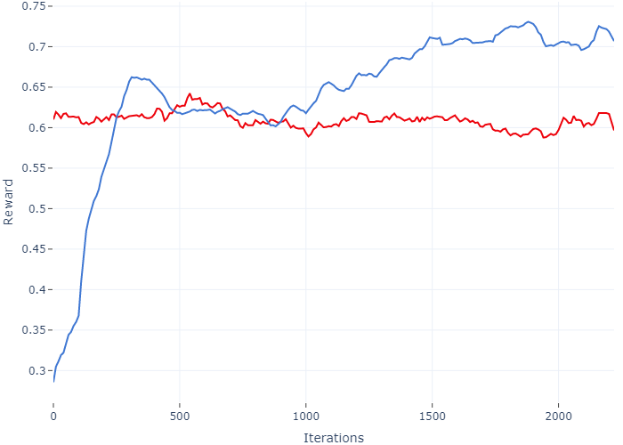

# SmartExcavator

## How it works?

Slides: https://docs.google.com/presentation/d/1zghz1NY8mvjboHIhBuQBRlYX4yq5YN74vpu2CCoh68M/edit?usp=sharing
Demonstration video: https://drive.google.com/open?id=1xaPrbcaeuSkuyYewuuIVlgGE9vkiKVN0

## Requirements

1. Python 3.6.8 or higher
2. Mevea Simulation Software
3. Excavator Model.

## Installation

1. Clone the repository:
```bash
git clone https://github.com/mizolotu/SmartExcavator -b tf2
```

2. From "SmartExcavator" directory, install required python packages (it is obviously recommended to create a new virtualenv and install everything there):
```bash
python -m pip install -r requirements.txt
```

3. Open Mevea Modeller and load Excavator Model. Go to Scripting -> Scripts, create a new script object, select "env_backend.py" from "SmartExcavator" directory as the file name in the object view. Go to I/O -> Inputs -> Input_Slew (or any other input component) and select the object just created as the script name. 

4. In terminal, navigate to the Mevea Software resources directory (default: C:\Program Files (x86)\Mevea\Resources\Python\Bin) and install numpy and requests:
```bash
python -m pip install numpy requests
```

## Demo

In terminal, navigate to "SmartExcavator" directory and run: 
```bash
python excavator_demo.py -m path_to_the_excavator_mvs
```

Once the solver has started, use joysticks or keyboard to grab some soil with the excavator and put it to the dumper. After that, the reinforcement learning agent kicks in and attempts to complete the work.

## Continue training

Both models have been learned for several days so far. To continue training, substitute "policy_name" with either "residual" or "pure" (default: residual) and specify number of environments (default: 2), for example:
```bash
python excavator_demo.py -m path_to_the_excavator_mvs -t train -p residual -n 2
```

Both pure and residual policies are learned using OpenAI's implementation of proximal policy optimization (PPO2) algorithm. The difference is that in case of pure reinforcement learning, demonstration data is only used to navigate the excavator to the target, after that the agent starts exploring the environment from scratch. In case of residual learning, the resulting policy is equal to sum of the agent policy and the best (in terms of the amount of soil grabbed) demonstration example. According to https://arxiv.org/pdf/1906.05841.pdf, residual learning outperforms other forms of learning from demonstration. 

The amount of trainable variables of the neural network can be increased in "baselines/common/models.py". Find the "mlp" model and increase the number of layers and the number of neurons in the hidden layers, e.g. num_layers=3 and num_hidden=256. Bigger numbers of parameters require more iterations to train, but in theory the resulting model should perform better. Regardless of the neural network architecture, at least one week of training is required to see some progress. In the figure below, the red line is the reward caclulated for the demonstration examples and the blue line is the evolution of the RL agent reward (pure) during first two weeks:


## Other scripts

plot_progress.py - plots mean, minimal and maximal rewards obtained during the training and stored in "progress.csv" file. Usage:
```bash
python plot_progress.py policy_name
```

select_demonstration.py - simulates the excavator inputs using the demonstration data and selects the best example in terms of the mass of soil grabbed and amount of soil lost during the turn to the dumper. The trajectories found are stored in files "data/dig.txt" and "data/emp.txt" respectively. Usage:
```bash
python select_demonstration.py path_to_excavator_mvs
```

These trajectories are the ones used by the agent to learn its policy, not the ones that the user inputs during the inference stage. This can be easily modified in such a way that the trajectories are built based on the user's input, but it would not make much sense, because an unexperienced user would certainly like to use the demonstration data recorded by a professional operator, instead of his/her own. 

## Known issues

1. Excavator may get stuck if the slew angle is about 135 degrees, becasue of the collison betweeen the bucket and the corner of the excavator platform.
2. Excavator always rotates in the same direction that has been specified during the user's input, because it cannot read minds.  
3. Spawing several instances of the solver during the training not only slows down the training, but may also negatively affect the policy learned, if the speed loss is significant. We recommend to run a single training iteration using only one solver, then restart with two solvers and compare the time spent in both of those cases. If the increase of the iteration duration is not significant, you can try to increment the number of environments.   
4. Running "excavator_demo.py" in the train mode results in file "progress.csv" being overwritten. For this reason, executing "plot_progress.py" only makes sense immediately after (or during) the training.
5. Communication between excavator gym environment specified in "excavator_env.py" and "env_backend.py" running by the solver instance is carried out via http (flask), which is probably overkill.
